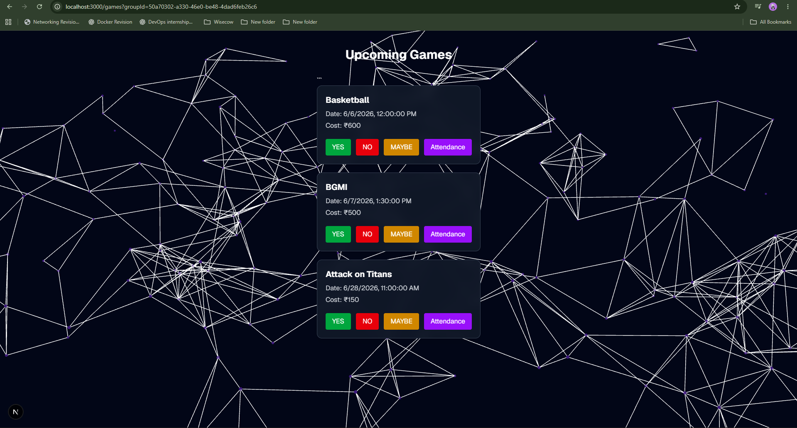

# Group Organizer 📊

A lightweight invite-only web app to manage recurring sports groups with RSVP tracking, game scheduling, attendance, and payment management.

---

## 🚀 Features

* Google Auth (Supabase)
* Group creation and invite system
* RSVP system (Yes / No / Maybe)
* Game scheduling with cost tracking
* Members management (roles: organizer, member, co-organizer)
* Attendance tracking
* Payment submission with UPI reference


---

## 🏠 Dashboard

The dashboard is the main control center where users can:

* Create new groups
* View all created groups
* Generate invite links
* Create games inside each group

### 📸 Screenshot

> Add screenshot here


---

## 👥 Members Page

The members page shows all users in a group with their roles and management options.

### Features:

* View group members
* Promote / demote roles (organizer only)
* Remove members
* View email & name from profiles

### 📸 Screenshot


---

## 🎮 Games Page

The games page shows all upcoming games for a group.

### Features:

* View game details (title, date, cost)
* RSVP system (YES / NO / MAYBE)
* Real-time attendance updates

### 📸 Screenshot

> Add screenshot here





---

## 📊 Attendance Leaderboard

Tracks attendance percentage per user.

### Features:

* Total games attended
* Attendance percentage
* Ranking system

---

## 🧱 Tech Stack

* Next.js (App Router)
* TypeScript
* Tailwind CSS
* Supabase (Auth + DB)
* PostgreSQL

---

## ⚙️ Setup Instructions

```bash
npm install
npm run dev
```

Create `.env` file:

```
NEXT_PUBLIC_SUPABASE_URL=your_url
NEXT_PUBLIC_SUPABASE_ANON_KEY=your_key
```

---

## 🚀 Deployment

Deploy easily on Vercel:

1. Push code to GitHub
2. Import project in Vercel
3. Add environment variables
4. Deploy

---

## 👨‍💻 Author

Built as part of Group Organizer system for managing recurring sports groups.

---
